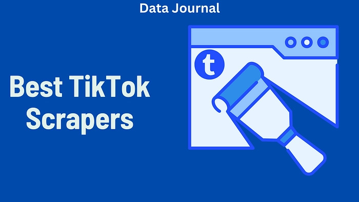
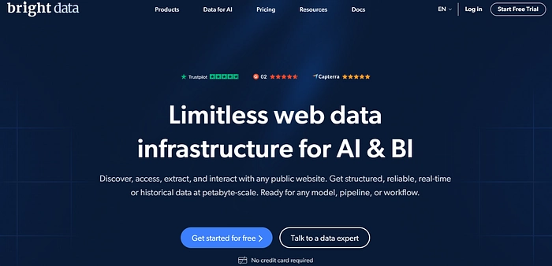
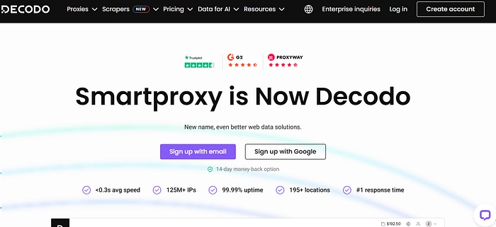
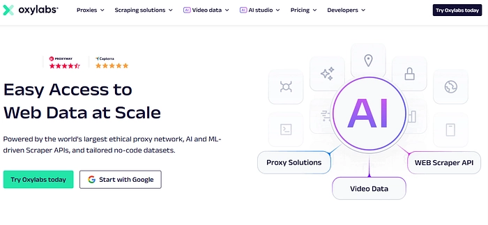
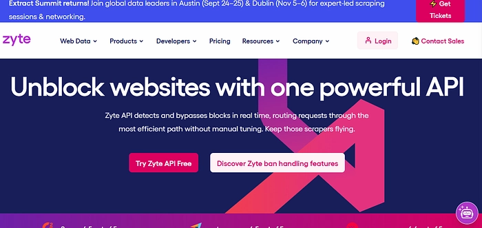
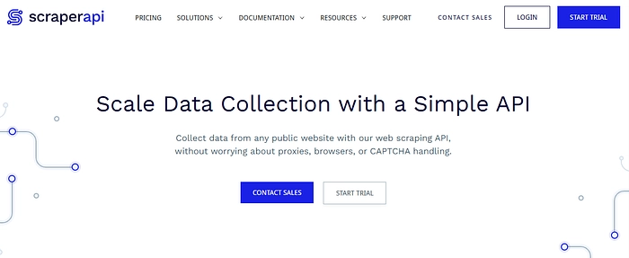
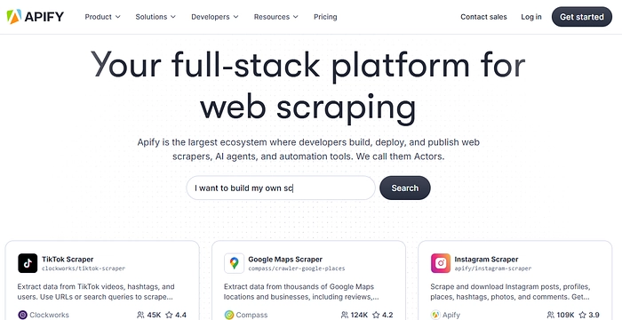

# 2025年最值得用的6款TikTok数据采集工具

---

TikTok上藏着海量公开数据——用户行为、热门趋势、互动模式，对营销人员、品牌方和研究者来说都是宝藏。但手动收集这些数据？基本不可能。

这篇文章会帮你找到**真正好用的TikTok采集工具**。我们测试了市面上的主流方案,从适合新手的傻瓜式工具,到能处理百万级数据的企业方案都有。每个工具的优缺点、适用场景、价格我们都列清楚了,你可以直接对号入座。

---

## 六款工具快速预览

- **Bright Data**: 需要大规模、高质量数据采集的企业首选
- **Decodo**: 开发者友好的实时API方案
- **Oxylabs**: 功能强大,适合复杂的批量采集任务
- **Zyte**: 专攻JavaScript动态内容,速度快
- **ScraperAPI**: 预算有限的小项目理想选择
- **Apify**: 零代码基础也能上手的可视化平台

---

## 1. Bright Data — 企业级采集方案

Bright Data在网络采集领域算是老大哥级别。它提供三种产品线:Web Unlocker、TikTok Scraper API和现成数据集,可以根据需求选择。

这家的优势是**覆盖面广、成功率高**。150多个国家都能定位,甚至能精确到城市级别。他们用了一些技术手段来规避平台的反爬虫机制,所以即使是大批量采集也很稳定。24/7客服随时在线,碰到问题能马上解决。

价格确实不便宜,但质量摆在那。如果你需要快速采集大量TikTok数据,并且预算充足,Bright Data是靠谱的选择。

**核心功能:**
- 三条产品线可选(Web Unlocker / Scraper API / 数据集)
- 150+国家覆盖,支持城市级定位
- 内置代理管理
- 高成功率的实时采集
- 可直接购买处理好的数据集

**优点:**
- 性能出色,成功率高
- 功能丰富,可定制性强
- 企业级支持,配专属客户经理
- 不想自己搭建爬虫的话可以直接买数据

**缺点:**
- 价格偏高,小项目用不划算
- 新手可能觉得复杂

**价格:**
- Web Unlocker: 每1000次请求$1.5
- Scraper API: 每1000条记录$1.5
- 数据集: 10万条记录起步价$250
- 商业账户有7天免费试用

---

## 2. Decodo — 开发者的API工具箱

Decodo是专门给会写代码的人用的。它提供简洁的API接口,支持实时和批量两种采集模式。

这个工具的**亮点是灵活**。你可以用Python、PHP、Node.js等主流语言调用API。自带JSON解析器,拿到的数据格式很干净。他们还提供了一个API Playground,可以在正式运行前先测试代码,这对开发者很友好。👉 [想快速测试TikTok数据采集?试试这个开发者工具](https://www.scraperapi.com/?fp_ref=coupons)

服务稳定,速度也快。不过每次请求只能拿一条数据,不支持批量返回,这点需要注意。

**核心功能:**
- 社交媒体采集API(支持TikTok)
- 同步/异步请求都能处理
- 内置JSON数据解析
- API Playground实时测试环境
- 多种编程语言的代码示例

**优点:**
- API简单,支持多种编程语言
- Playground对新手友好
- 服务快且稳
- 实时和批量采集都支持

**缺点:**
- 不支持批量结果(每次请求只返回1条)
- 不适合非技术用户

**价格:**
- 9万次请求$30(每千次约$0.32)
- 提供100MB免费试用(7天)

---

## 3. Oxylabs — 高级批量采集方案

Oxylabs适合那些需要**大规模、长期采集**TikTok数据的用户。它的Web Scraper API和Web Unblocker能处理复杂页面,不容易被封。

代理池里有1亿多个IP地址,覆盖195个国家。你可以用CSS或XPath精确筛选想要的数据,还能设定定时任务让爬虫自动运行。这对需要持续监控TikTok趋势的场景特别有用。

需要一定技术基础才能用好,价格也不低。但如果你的采集任务很复杂或者数据量很大,Oxylabs的稳定性值这个价。

**核心功能:**
- Web Scraper API和Web Unblocker
- 195+国家的国家级定位
- CSS/XPath选择器解析
- 定时任务和批处理
- 1亿+IP的代理池

**优点:**
- 高成功率和可靠的基础设施
- 适合大规模采集
- 高级过滤和解析选项
- 包含爬虫和定时功能

**缺点:**
- 成本可能快速上涨
- 需要一定技术知识

**价格:**
- Web Scraper API: 36,296次请求$49(每千次约$1.35)
- Web Unblocker: 8GB起步价$75(每GB约$9.4)
- 提供7天免费试用

---

## 4. Zyte — 专攻动态内容的快速方案

Zyte的特点是**快**。它用浏览器模拟技术来加载页面,就像真人在浏览一样,所以能绕过TikTok的反爬虫机制。

TikTok上很多内容是用JavaScript动态加载的(比如视频、评论),普通爬虫拿不到完整数据。Zyte专门针对这种场景做了优化,支持JavaScript渲染,能抓到所有动态内容。

150多个全球节点可选,还支持用TypeScript写自动化脚本。价格从低到高都有,可以从小套餐开始试。控制面板能实时看到花了多少钱,不会超预算。

**核心功能:**
- 带浏览器模拟的Zyte API
- 150+全球节点
- JavaScript渲染(TikTok必需)
- 用TypeScript实现高级自动化
- 智能IP轮换和反封锁工具

**优点:**
- 速度快,可靠性高
- 特别适合JavaScript重度网站
- 企业用户有定制化支持
- 控制面板有成本预估功能

**缺点:**
- 加功能后价格涨得快
- 免费账户的支持选项有限

**价格:**
- 充值从$5起
- 根据使用功能定制价格
- 按量付费或订阅制都有

---

## 5. ScraperAPI — 小项目的实惠选择

ScraperAPI是这份清单里**最适合新手和小项目**的工具。它自动处理代理、验证码和封锁问题,你不用操心这些技术细节。

每月送1000个免费API额度,足够小规模测试用。支持JavaScript渲染(需要额外付费),能抓动态加载的内容。多种编程语言都能接入,设置起来很简单。

缺点是没有内置的数据解析功能,拿到的是原始HTML,需要自己处理。代理覆盖范围也比较基础,除非升级套餐。但对于**预算有限、不想写复杂代码的用户**来说,ScraperAPI是最省心的方案。

**核心功能:**
- 通用型API采集器
- 支持4种集成方式:代理/SDK/同步API/异步API
- 默认12个地区(申请后可达50+)
- JavaScript渲染作为附加功能
- 每月1000 API额度免费

**优点:**
- 特别适合小规模采集
- 价格实惠
- 支持多种编程语言
- 设置简单,快速上手

**缺点:**
- 没有内置解析器
- JavaScript渲染消耗更多额度
- 不升级的话代理覆盖有限

**价格:**
- 免费套餐: 每月1000额度
- 入门套餐: 10万额度$49
- JavaScript渲染需额外付费

---

## 6. Apify — 零代码的可视化平台

Apify最大的优势是**不需要写代码**。它提供现成的TikTok采集模板,包括用户资料、视频、话题标签、评论等,点几下鼠标就能用。

数据可以导出成CSV、JSON、Excel或XML格式。还能通过API、Webhook或云存储自动传输数据。免费账户能体验基本功能,够用了再升级。

界面很友好,设置流程也简单。唯一的问题是共享代理在TikTok上不太稳定,可能需要买住宅代理才能保证成功率。但对于**不想学编程、只想快速拿数据**的人来说,Apify是理想选择。

**核心功能:**
- 预设模板的零代码TikTok采集器
- 支持采集用户资料/视频/话题标签/评论
- 数据导出为JSON/CSV/Excel/XML
- 通过API/Webhook/云存储传输数据
- 共享和住宅代理可选

**优点:**
- 完全不需要编程知识
- 可定制选项多
- 轻度用户价格合理
- 模板可重复使用或修改

**缺点:**
- 免费套餐采集量有限
- 基于额度的定价不太好预测
- 共享代理在TikTok上不够稳

**价格:**
- 免费套餐: 5次运行,20条结果
- 基础套餐: $49/月,含30个共享代理
- 住宅代理: $12/GB

---

## 选工具前想清楚这三件事

挑TikTok采集工具,别光看功能多不多。先问自己:

1. **你会写代码吗?** 会的话API类工具更灵活;不会就选可视化平台
2. **要采集多少数据?** 几千条和几百万条,需要的方案完全不同
3. **预算多少?** 有的工具按请求次数收费,有的按流量,算清楚成本

还有重要的一点:**一定要合规**。TikTok的服务条款明确禁止某些采集行为,别碰私密数据和敏感信息。尊重平台规则,数据采集才能长久。

---

TikTok上的公开数据能帮你发现趋势、了解用户、优化策略。选对工具,这些数据就能变成你的优势。上面这6款工具各有特点,从零基础到技术大牛都能找到合适的。现在开始试试吧,看看哪款最符合你的需求。👉 [想要更稳定、更快速的TikTok数据采集?这个工具值得一试](https://www.scraperapi.com/?fp_ref=coupons)
